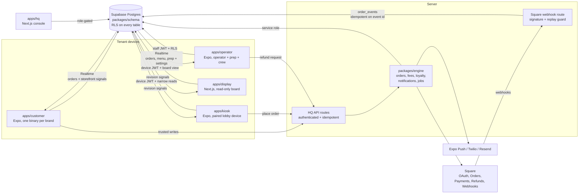

# Architecture

A multi-tenant, white-label ordering platform: one schema, one engine, five
store/customer surfaces plus HQ, and tenants represented as data.

## Data flow: one order, end to end

1. The guest builds a cart in `apps/customer` or `apps/kiosk` (pure modules: options, cart,
   totals with per-jurisdiction tax rows, tip, loyalty redemption, stored
   value). Money is integer cents everywhere.
2. Checkout calls the engine's `placeOrder`: an `orders` row (status
   `created`), a Square Order, then a Square Payment carrying
   `app_fee_money` computed by the fee service — the brand's `fee_bps`, with
   the portion of the month's gross above `tier_threshold_cents` charged
   `fee_bps_tier2` (a straddling payment splits). A `platform_fees` row
   records gross, fee, and effective bps per payment.
3. State moves only through `order_events` (append-only, JSONB snapshot per
   transition). A BEFORE INSERT trigger validates the transition against the
   machine (`created → paid → in_progress → ready → picked_up | cancelled |
   refunded`) and projects it onto `orders.status`.
4. Square's webhooks land on `apps/hq/app/api/webhooks/square` — signature
   verified, mapped to a state, appended idempotently on
   `square_event_id UNIQUE` (a replay dies at the constraint). Refunds also
   reverse the loyalty earn proportionally.
5. Supabase Realtime fans the projected `orders` row to the customer tracker
   and location-scoped operator board. Menu and prep rows have their own
   subscriptions. Public screens that must not receive a source row subscribe
   to payload-free revision tables, then reconcile through their narrow read.
   RLS decides who receives each change.
6. The operator advances orders from the board; changes ride a location-keyed,
   persistent offline queue that reconciles against server state on reconnect
   (illegal moves are dropped and surfaced, not replayed).

## Tenancy

Every table carries `brand_id` (and `location_id` where relevant); RLS reads
JWT `app_metadata` claims (`brand_id`, `location_ids[]`, `role`). Roles:
`platform_admin`, `brand_owner`, `location_manager`, `staff`; end customers
carry a brand and no role. The Square token table has **no** client policies
at all — only the engine's service role reaches it, and tokens are AES-256-GCM
encrypted at rest besides.

## Front ends

- **Customer**: white-label. Identity, palette, copy, feature flags hydrate
  from `tenants/<slug>/brand.json` via `@platform/ui`'s ThemeProvider (cached
  for offline cold starts); `app.config.ts` reads the same file at build time
  for bundle id, scheme, and store identity. One binary per brand.
- **Operator**: one listing; tenancy by login. The board is the first tab.
- **Kiosk**: one paired binary. Device posture and tenant flow determine lobby
  versus attended behavior; menu and ordering are live after pairing.
- **Pickup display**: one read-only board per paired location. It can subscribe
  only to payload-free revisions and reconcile through the display-safe view.
- **HQ**: role-gated console; the platform-fees report is `platform_admin`
  only. Demo mode remains reviewable without infrastructure; a configured
  console reads and writes hosted tenant state.

## Jobs

`scripts/run-jobs.ts` ticks drops (`scheduled → live → ended` on their
windows, with the missed-window case going straight to `ended`) and claims
due campaigns (`scheduled → sending`, claim-first so a racing tick cannot
double-send).

## Vocabulary

"Module" used to name two unrelated things here, and one string belonged to
both sides. It now names one, and this section records what the other became
so a reviewer reading an older commit, migration, or stored release can follow
it.

- **Capability module** — a unit of platform functionality a tenant can have
  or not have. `ModuleDefinition` in `packages/module-kit/src/registry.ts`;
  that registry is the complete list. Keys are `commerce-catalog`,
  `workforce-operations`, `local-printing` and their siblings. A tenant
  declares its installs in `tenants/<slug>/modules.json`; the runtime set is
  `module_installations`, one row per brand and key. Capability modules gate
  routes, jobs, APIs, and navigation. This is the only thing "module" means.
- **Training track** — a group of lessons inside training *content*:
  `TrainingTrack` in `packages/domain/src/training.ts`. A track is addressed
  by `slug` and nothing else. A slug in `TRAINING_TRACK_ORDER` (`knowledge`,
  `skills`, `service`, `safety`, `operations`) is a core track, present in
  every release because `normalizeTrainingManifest` adds an empty shell for
  any that is missing; every other slug is a track the tenant wrote, and it
  sorts after the five. Content is not a capability: all of it belongs to the
  one `workforce-training` capability module.
- **`'training_module'` / `'training_lesson'`** — neither of the above. These
  are string literals in the schema: `entity_type` in the content-media and
  catalog tables, and resource kinds in a catalog template's manifest. They
  say which kind of content row a media version or catalog resource points at.
  They are deliberately unrenamed: they are shared with the catalog tables and
  pinned by a CHECK constraint, so they move on their own schedule.

The overlap that bites: `operations` is a training track slug and
`workforce-operations` is a capability module key. Nothing connects them — a
tenant can install `workforce-operations` and publish no operations training,
or publish that training with the capability module absent.

### What the training rename changed, and what it cost

A track carried a second key, `trackKey`, beside its slug. Seeded content set
the two to the same value, but the HQ editor let an author give a track a
descriptive slug and file it under a core `trackKey`, or mark it `'custom'`.
The two vocabularies then disagreed, and code had to guess: the editor's rail
matched `trackKey === key || slug === key`, and the operator's track list did
the same and then listed anything without a `trackKey` a second time under
"Additional training".

Only the slug was ever an identity. `training_lesson_progress.track_slug`,
`training_quiz_attempts.track_slug`, `training_competency_awards.track_slug`,
the answer key, the operator URL segment, the media-history `entity_key`, and
the `slug` match inside `award_operation_competency` all key on it; nothing
persisted keyed on `trackKey`. So `trackKey` was deleted rather than renamed,
and `'custom'` — which was never a member of `TRAINING_TRACK_ORDER` — became a
question you ask about a slug instead of a value you store:
`isCoreTrainingTrack(slug)`.

The cost is real and worth stating. An author can no longer file a
descriptively-slugged track under a core track's heading; a track with a slug
outside the core five is a tenant track, sorts after them, and gets no core
artwork. And a release published under schema 1, whose `trackKey` had been
*inferred* from the title, keeps its slug and therefore moves out of whatever
core track that inference had put it in — its lessons, progress rows, and
awards are untouched, but it appears under "Additional training" beside an
empty core shell. Nothing in this repository produces a manifest where the two
disagree, so no seeded or template content is affected.

The manifest itself is schema 3: the array is `tracks`, not `modules`. Every
reader goes through `liftTrainingManifest`, which accepts 1, 2, and 3, because
a published release is immutable and one is live per tenant. The three
server-side readers — `publish_manual_training_release`,
`award_operation_competency`, and `app.capture_training_media_versions` —
accept both spellings for the same reason.
