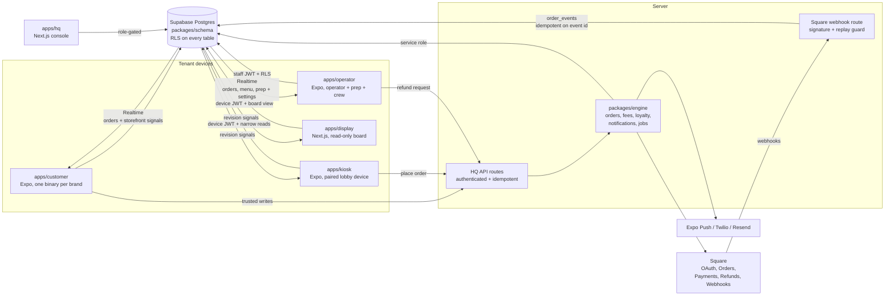

# Architecture

A multi-tenant, white-label ordering platform: one schema, one engine, five
store/customer surfaces plus HQ, and tenants represented as data.

## Data flow: one order, end to end

1. The guest builds a cart in `apps/customer` or `apps/kiosk` (pure modules: options, cart,
   totals with per-jurisdiction tax rows, tip, loyalty redemption, stored
   value). Money is integer cents everywhere.
2. Checkout calls the engine's `placeOrder`: an `orders` row (status
   `created`), a Square Order, then a Square Payment carrying
   `app_fee_money` computed by the fee service — the brand's `fee_bps`, with
   the portion of the month's gross above `tier_threshold_cents` charged
   `fee_bps_tier2` (a straddling payment splits). A `platform_fees` row
   records gross, fee, and effective bps per payment.
3. State moves only through `order_events` (append-only, JSONB snapshot per
   transition). A BEFORE INSERT trigger validates the transition against the
   machine (`created → paid → in_progress → ready → picked_up | cancelled |
   refunded`) and projects it onto `orders.status`.
4. Square's webhooks land on `apps/hq/app/api/webhooks/square` — signature
   verified, mapped to a state, appended idempotently on
   `square_event_id UNIQUE` (a replay dies at the constraint). Refunds also
   reverse the loyalty earn proportionally.
5. Supabase Realtime fans the projected `orders` row to the customer tracker
   and location-scoped operator board. Menu and prep rows have their own
   subscriptions. Public screens that must not receive a source row subscribe
   to payload-free revision tables, then reconcile through their narrow read.
   RLS decides who receives each change.
6. The operator advances orders from the board; changes ride a location-keyed,
   persistent offline queue that reconciles against server state on reconnect
   (illegal moves are dropped and surfaced, not replayed).

## Tenancy

Every table carries `brand_id` (and `location_id` where relevant); RLS reads
JWT `app_metadata` claims (`brand_id`, `location_ids[]`, `role`). Roles:
`platform_admin`, `brand_owner`, `location_manager`, `staff`; end customers
carry a brand and no role. The Square token table has **no** client policies
at all — only the engine's service role reaches it, and tokens are AES-256-GCM
encrypted at rest besides.

## Front ends

- **Customer**: white-label. Identity, palette, copy, feature flags hydrate
  from `tenants/<slug>/brand.json` via `@platform/ui`'s ThemeProvider (cached
  for offline cold starts); `app.config.ts` reads the same file at build time
  for bundle id, scheme, and store identity. One binary per brand.
- **Operator**: one listing; tenancy by login. The board is the first tab.
- **Kiosk**: one paired binary. Device posture and tenant flow determine lobby
  versus attended behavior; menu and ordering are live after pairing.
- **Pickup display**: one read-only board per paired location. It can subscribe
  only to payload-free revisions and reconcile through the display-safe view.
- **HQ**: role-gated console; the platform-fees report is `platform_admin`
  only. Demo mode remains reviewable without infrastructure; a configured
  console reads and writes hosted tenant state.

## Jobs

`scripts/run-jobs.ts` ticks drops (`scheduled → live → ended` on their
windows, with the missed-window case going straight to `ended`) and claims
due campaigns (`scheduled → sending`, claim-first so a racing tick cannot
double-send).

## Vocabulary

"Module" names two unrelated things here, and one string belongs to both
sides, so a reviewer cannot tell from the word alone which is meant. Say
which in full.

- **Capability module** — a unit of platform functionality a tenant can have
  or not have. `ModuleDefinition` in `packages/module-kit/src/registry.ts`;
  that registry is the complete list. Keys are `commerce-catalog`,
  `workforce-operations`, `local-printing` and their siblings. A tenant
  declares its installs in `tenants/<slug>/modules.json`; the runtime set is
  `module_installations`, one row per brand and key. Capability modules gate
  routes, jobs, APIs, and navigation.
- **Training module** — a group of lessons inside training *content*:
  `TrainingModule` in `packages/domain/src/training.ts`, addressed by `slug`
  and grouped by `trackKey`, whose values are `TRAINING_TRACK_ORDER`
  (`knowledge`, `skills`, `service`, `safety`, `operations`). Content is not a
  capability: all of it belongs to the one `workforce-training` capability
  module. Step 3 of `MODULAR-OFFLINE-FRANCHISE-PLAN.md` renames this to a
  track precisely to end the collision, so prefer "training track" in new
  prose even while the type is still called `TrainingModule`.
- **`'training_module'` / `'training_lesson'`** — neither of the above. These
  are string literals in the schema: `entity_type` in the content-media and
  catalog tables, and resource kinds in a catalog template's manifest. They
  say which kind of content row a media version or catalog resource points at.

The overlap that bites: `operations` is a training track key and
`workforce-operations` is a capability module key. Nothing connects them — a
tenant can install `workforce-operations` and publish no operations training,
or publish that training with the module absent.
