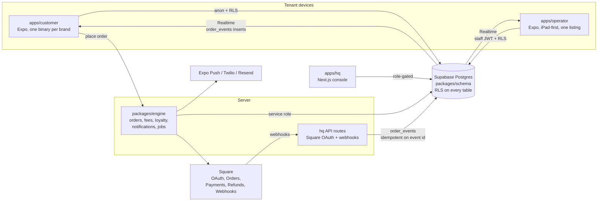

# Architecture

A multi-tenant, white-label ordering platform: one schema, one engine, three
front ends, tenants as data (and one folder of config each).

## Data flow: one order, end to end

1. The guest builds a cart in `apps/customer` (pure modules: options, cart,
   totals with per-jurisdiction tax rows, tip, loyalty redemption, stored
   value). Money is integer cents everywhere.
2. Checkout calls the engine's `placeOrder`: an `orders` row (status
   `created`), a Square Order, then a Square Payment carrying
   `app_fee_money` computed by the fee service — the brand's `fee_bps`, with
   the portion of the month's gross above `tier_threshold_cents` charged
   `fee_bps_tier2` (a straddling payment splits). A `platform_fees` row
   records gross, fee, and effective bps per payment.
3. State moves only through `order_events` (append-only, JSONB snapshot per
   transition). A BEFORE INSERT trigger validates the transition against the
   machine (`created → paid → in_progress → ready → picked_up | cancelled |
   refunded`) and projects it onto `orders.status`.
4. Square's webhooks land on `apps/hq/app/api/webhooks/square` — signature
   verified, mapped to a state, appended idempotently on
   `square_event_id UNIQUE` (a replay dies at the constraint). Refunds also
   reverse the loyalty earn proportionally.
5. Supabase Realtime fans `order_events` inserts out: the customer app's
   tracking timeline and the operator's board both re-render from the same
   events. RLS decides who receives which rows.
6. The operator advances orders from the board; changes ride an offline
   queue that reconciles against server state on reconnect (illegal moves are
   dropped and surfaced, not replayed).

## Tenancy

Every table carries `brand_id` (and `location_id` where relevant); RLS reads
JWT `app_metadata` claims (`brand_id`, `location_ids[]`, `role`). Roles:
`platform_admin`, `brand_owner`, `location_manager`, `staff`; end customers
carry a brand and no role. The Square token table has **no** client policies
at all — only the engine's service role reaches it, and tokens are AES-256-GCM
encrypted at rest besides.

## Front ends

- **Customer**: white-label. Identity, palette, copy, feature flags hydrate
  from `tenants/<slug>/brand.json` via `@platform/ui`'s ThemeProvider (cached
  for offline cold starts); `app.config.ts` reads the same file at build time
  for bundle id, scheme, and store identity. One binary per brand.
- **Operator**: one listing; tenancy by login. The board is the first tab.
- **HQ**: role-gated console; the platform-fees report is `platform_admin`
  only. Renders fully on fixtures with zero infrastructure so every page is
  reviewable before credentials exist.

## Jobs

`scripts/run-jobs.ts` ticks drops (`scheduled → live → ended` on their
windows, with the missed-window case going straight to `ended`) and claims
due campaigns (`scheduled → sending`, claim-first so a racing tick cannot
double-send).
