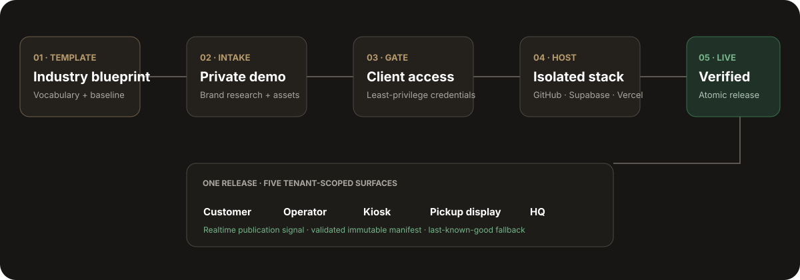

# Platform factory: clone to live

The recommended model is **one isolated GitHub/Supabase/Vercel stack per industry**
and **many RLS-isolated tenant brands inside that stack**. This gives franchise
operators shared upgrades without mixing mutable customer data, and lets a materially
different industry evolve independently.

The HQ **Settings → Onboarding** page is the operator surface. It creates a private,
idempotent run in hosted Supabase, exposes reviewed credential walkthroughs, and
advances through research, demo, access, infrastructure, content, canary, and live
stages. Paid resources and external accounts are never created before the credential
gate. Failed validation leaves the previous release active.

## What is automated

1. Validate an industry blueprint and tenant intake.
2. Research public brand facts and prepare draft assets with source/rights metadata.
3. Build and verify a private five-surface demo.
4. Pause for the human-owned account access that cannot legally be automated.
5. Create or select the GitHub repository, Doppler project/configs, hosted Supabase
   project, and five Vercel projects.
6. Apply migrations, seed the tenant overlay, upload immutable media, and publish
   catalog/training releases atomically.
7. Verify customer → operator → pickup order propagation and HQ editing in canary.
8. Promote only after all required gates pass; otherwise roll back to last known good.

The durable executor currently completes steps 1–5. It then records
`content_bootstrap_required` and stops before any public release. Steps 6–8 remain in
the persisted task graph so a partial run is visible and resumable, but they must not
be represented as complete until the migration/seed, canary, and promotion executors
are connected and verified.

The workflow `.github/workflows/deploy-hosted.yml` accepts `tenant`, `project_prefix`,
and `environment`. Coffee Story remains the default, so existing deployment commands
keep working. New stacks use `<project_prefix>-hq`, `-customer`, `-operator`, `-kiosk`,
and `-display`.

## Secret architecture

- Doppler is the authoring/control-plane store for platform and provider secrets.
- Supabase Vault stores runtime connector secrets that server-side database workflows
  must resolve.
- Public Supabase tables store only opaque secret references and verification state.
- Vercel receives the smallest environment-specific subset needed by each project.
- Native/public prefixes contain only publishable configuration.
- Apple, Google Play, and Expo credentials remain in client-owned accounts; the client
  grants a scoped role instead of sharing a personal password.

Use the variables in `.env.example`. Production runtimes use Doppler service tokens,
which are restricted to one config; Doppler explicitly recommends them over personal
tokens for live environments. See the [Doppler service-token guide](https://docs.doppler.com/docs/service-tokens).

## Credential walkthroughs

### GitHub

Owner: platform. Create a GitHub App with the minimum repository administration and
contents permissions needed to create/configure the cloned repository, plus Actions,
Actions secrets, and Actions variables write access for the encrypted deployment
handoff. Install it only
on the template organization or selected repositories. GitHub Apps start with no
permissions, and GitHub recommends selecting only what is required. Store the app ID,
installation ID, and private key in Doppler—not in GitHub variables or tenant folders.
Also configure `GITHUB_REPOSITORY_OWNER`, `GITHUB_TEMPLATE_OWNER`, and
`GITHUB_TEMPLATE_REPOSITORY`; the template repository must be marked as a GitHub
template and the Vercel GitHub App must be allowed to read generated repositories.
The factory writes only the names of synchronized secrets to its audit metadata; values
are sealed with the repository public key before GitHub receives them.
[Official GitHub permissions guide](https://docs.github.com/en/apps/creating-github-apps/registering-a-github-app/choosing-permissions-for-a-github-app).

### Doppler

Owner: platform. Create a `platform-factory` project with `dev`, `preview`, and
`production` configs. The factory uses a service-account token to create tenant-scoped
projects/configs; deployed apps use read-only service tokens for a single config. Copy
each one-time token directly into the destination secret store.
Set `DOPPLER_PRODUCTION_CONFIG` only when the workplace does not use the default
`prd` root config.
[Official Doppler service-token guide](https://docs.doppler.com/docs/service-tokens).

### Supabase

Owner: platform or client organization. Use a fine-grained Management API token with
project-creation access for the selected organization. Project creation requires a
database password; generate it in the workflow and store it immediately in Doppler.
Synchronize it into the generated repository as the encrypted Actions secret
`SUPABASE_DB_PASSWORD`; Supabase deliberately does not return a production database
password or connection URL through the Management API later. Never return it to a
browser or persist it in the control-plane tables. The Management
API is rate-limited, so the factory tasks use bounded retries and idempotency.
[Official Supabase Management API](https://supabase.com/docs/reference/api/getting-started).

### Vercel

Owner: platform. Create a scoped team access token, record the team/scope ID, and allow
the factory to create five projects and environment variables. Environment changes
apply only to new deployments, so every secret/config change must be followed by a
canary rebuild before promotion. [Official Vercel REST API](https://vercel.com/docs/rest-api)
and [environment-variable guide](https://vercel.com/docs/environment-variables).

### Apple App Store

Owner: client Account Holder. The client enrolls its organization, accepts agreements,
creates the explicit App ID, and invites the release operator. Prefer an App Store
Connect API key over an app-specific password; Apple shows a private key only once, so
place it directly in the client-owned Expo/EAS credential store. The Account Holder
must request API access before keys can be generated.
[Official App Store Connect API setup](https://developer.apple.com/help/app-store-connect/get-started/app-store-connect-api).

### Google Play

Owner: client Account Holder. Use an organization developer account, enable the Google
Play Developer API, create a service account, and invite that service-account email in
Play Console with access limited to the specific branded application. Google recommends
a service account for secure server-to-server publishing.
[Official Google Play Developer API setup](https://developers.google.com/android-publisher/getting_started).

### Expo/EAS

Owner: client organization. The branded customer app and kiosk use separate EAS project
IDs; the operator remains the shared staff app. Prefer EAS-managed signing credentials.
Expo recommends App Store Connect API keys for iOS submissions and keeps managed
credentials encrypted. [Expo credential security](https://docs.expo.dev/app-signing/security/)
and [store submission guide](https://docs.expo.dev/deploy/submit-to-app-stores/).

## Tenant and industry file boundaries

`industries/<key>/blueprint.json` contains reusable vocabulary and template version.
`tenants/<slug>/` contains only portable brand inputs. Generated app files are build
artifacts; hosted Supabase is the source of truth once the tenant is live. Do not create
tenant-specific source forks. Every database row, storage path, analytics event,
connector installation, and release carries the tenant/brand boundary.

## Operator checklist

- Create the private run in HQ and approve researched brand facts/media rights.
- Verify each credential card; never paste secrets into notes or source files.
- Run hosted migration dry-run, push, and remote schema lint.
- Dispatch `deploy hosted surfaces` with the run's tenant and project prefix.
- Verify the five-app wall, realtime order flow, catalog/training publication, RLS
  isolation, accessibility, error monitoring, and rollback.
- Enable native publishing only after the client store accounts and legal agreements are
  ready. Missing access stays `Setup required`; it never reports a false production pass.

## Billing contract encoded by the factory

- First 30 days: $0 setup and $0 platform fee; 2% app-order commission.
- Initial location: $5,500 paid in full or $600/month for 12 months; financing still
  carries the separate $249/month platform fee after the trial.
- Commission is marginal per location/calendar month: 2% through $25,000 of app-order
  gross and 1.5% only above it.
- Additional location: $2,500 setup plus $299/month and the same commission schedule.
- Day-90 guarantee: if app gross is under 10% of total Square gross, cancel remaining
  setup installments and credit setup already paid. Authoritative commerce records—not
  behavioral telemetry—drive the calculation.
